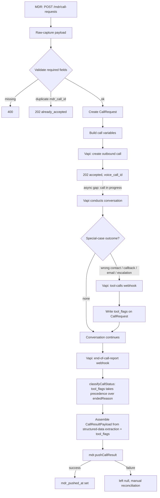

# Call Flow

## Node-to-spec cross reference

| Node | Client spec section |
|---|---|
| Raw-capture / validate | §2 "What MDR Will Send to Voice API" |
| Build call variables (previous_interactions/open_items) | §3 "Previous Conversation Information" |
| Vapi conducts conversation — introduction | §4 "Voice Agent General Introduction" |
| Vapi conducts conversation — per call_type questions | §5-8 (OUT_FOR_DELIVERY / PICKUP_TODAY / DISPATCHED / IN_TRANSIT) |
| Reconfirm-not-reask behavior | §9 "If Previous Information Exists" |
| NO_ANSWER / BUSY (no tool, endedReason-derived) | §10 "No Answer" |
| LEFT_VOICEMAIL (no tool, endedReason-derived) | §11 "Voicemail" |
| reportWrongContact tool | §12 "Wrong Person" |
| reportCallbackRequested tool | §13 "Callback Requested" |
| reportEmailRequested tool | §14 "Email Requested" |
| CALL_DROPPED (partial capture) | §15 "Call Dropped" |
| Null-not-guessed fields | §16 "Carrier Does Not Know an Answer" |
| flagHumanEscalation tool | §17 "Serious Issue / Human Escalation" |
| Structured result assembly | §18-19 "Voice Must Return Structured Information" / "Common Response Format" |
| call_status enum | §20 "Required Call Statuses" |
| Whole flow | §21-22 "Important Rules" / "Very Simple Responsibility Split" |
