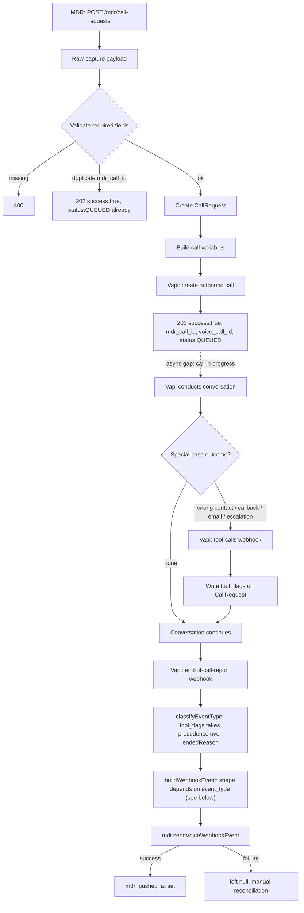

# Call Flow

## Webhook event shapes (NOT one universal envelope)

MDR's webhook (`POST https://api.mydrayrate.com/api/v1/agent3/voice/webhook`)
takes a different payload per `event_type` — see `src/mdr/types.ts`'s
`VoiceWebhookEvent`:

| event_type | Payload beyond `{event_type, mdr_call_id, voice_call_id}` |
|---|---|
| `NO_ANSWER` / `VOICEMAIL` / `BUSY` / `CALL_FAILED` | none — minimal shape |
| `CALL_DROPPED` | `partial_result` (whatever of the common result was captured), `summary` |
| `CALLBACK_REQUESTED` | `callback_after_minutes` (number), `summary` |
| `WRONG_CONTACT` | `referred_contact: {name, phone}` |
| `CALL_COMPLETED` | `call_type`, `call_status: "COMPLETED"`, full `result` object, `recording_url`, `transcript` |

## Node-to-spec cross reference

References "MDR Agent 3 – Voice API Integration Guide" (confirmed) unless
marked otherwise.

| Node | Spec section |
|---|---|
| Raw-capture / validate | §3 "What MDR Sends to Voice Team" |
| Immediate ack (`success`, `status: QUEUED`) | §4 "Voice Team Immediate API Response" |
| Build call variables (`previous_summary`/`open_issue`/`questions[]`) | §3, §9 "Previous Conversation Must Be Used" |
| Vapi conducts conversation — introduction | original informal spec §4 (kept, not superseded) |
| Vapi conducts conversation — per call_type questions | §8 (OUT_FOR_DELIVERY / PICKUP_TODAY / DISPATCHED / IN_TRANSIT) |
| Reconfirm-not-reask behavior | §9 "Previous Conversation Must Be Used" |
| `NO_ANSWER` | §6 "No Answer Example" |
| `VOICEMAIL` / `BUSY` / `CALL_FAILED` | §5 (listed, shape assumed — see requirements-tracker.md) |
| `reportWrongContact` tool → `WRONG_CONTACT` | §10 "Wrong Contact" |
| `reportCallbackRequested` tool → `CALLBACK_REQUESTED` | §10 "Callback Requested" |
| `reportEmailRequested` tool | no confirmed event_type — see requirements-tracker.md |
| `CALL_DROPPED` (partial capture) | §10 "Call Dropped" |
| Null-not-guessed fields | §7A "true=yes, false=no, null=unknown" |
| `appointment_status` enum | §7B |
| `confidence_score` | §7C |
| `flagHumanEscalation` tool + escalation criteria | user-provided escalation rule, see `docs/business-requirements.md` |
| `CALL_COMPLETED` result assembly | §7 "Call Completed Webhook" |
| What MDR controls vs. Voice Team controls | §11-12 |
| Whole flow | §1 "Main Flow", §13 "Developer Reference" |
